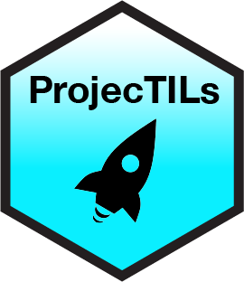
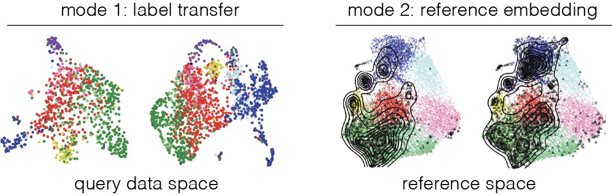
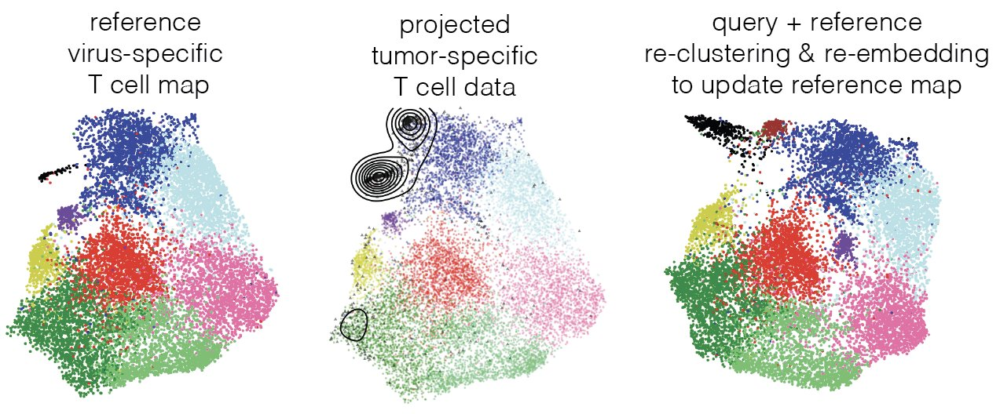

# A framework for reference-based single-cell RNA-seq data analysis

<p align="center">



</p>

`ProjecTILs` is a computational method to project scRNA-seq data into reference single-cell atlases, enabling their direct comparison in a stable, annotated system of coordinates.

In contrast to other methods, ProjecTILs allows not only accurately embedding new scRNA-seq data into a reference without altering its structure, but also characterizing previously unknown cell states that "deviate" from the reference. ProjecTILs accurately predicts the effects of cell perturbations and identifies gene programs that are altered in different conditions and tissues.

You can use `ProjecTILs` pre-defined cell type-specific [reference maps](#reference-atlases) or create your own (see [Building a custom reference atlas for ProjecTILs](https://carmonalab.github.io/ProjecTILs.demo/build_ref_atlas.html)) for any cell type[s] of interest.

For real-life applications, check out our list of [ProjecTILs Case Studies](https://carmonalab.github.io/ProjecTILs_CaseStudies/)

Find the installation instructions for the package below, and a vignette detailing its functions at [Tutorial (html)](https://carmonalab.github.io/ProjecTILs.demo/tutorial.html) and [Tutorial (repository)](https://github.com/carmonalab/ProjecTILs.demo)

### Package Installation

To install `ProjecTILs` directly from its Git repository, run the following code from within R or RStudio:

``` r
install.packages("remotes")
library(remotes)

remotes::install_github("carmonalab/STACAS")
remotes::install_github("carmonalab/ProjecTILs")
```

### Test the package

Load sample data and test your installation:

``` r
library(ProjecTILs)
ref <- load.reference.map()
data(query_example_seurat)

query.projected <- Run.ProjecTILs(query_example_seurat, ref=ref)
```

By default, `load.reference.map()` downloads and loads a reference for mouse tumor-infiltrating T cells. Read below where to find other references or how to build your own reference map.

### Data projection DEMO

Find a step-by-step tutorial for `ProjecTILs` at: [ProjecTILs tutorial](https://carmonalab.github.io/ProjecTILs.demo/tutorial.html)

### Running ProjecTILs

You can use ProjecTILs in two modes:

**Mode 1:** just for label transfer, faster, doesn't alter your dimensionality reduction

``` r
ProjecTILs.classifier(query = query_object, ref = reference_map)
```

**Mode 2:** reference embedding, to explore your dataset in the context of a stable reference map

``` r
Run.ProjecTILs(query = query_object, ref = reference_map)
```

<p align="center">



</p>

### ProjecTILs CASE STUDIES

For real-life applications on public datasets, check out our list of [ProjecTILs Case Studies](https://carmonalab.github.io/ProjecTILs_CaseStudies/)

### Documentation

See a description of the functions implemented in ProjecTILs at: [ProjecTILs functions](docs/functions.md)

### Reference Maps

Reference atlases are generated by comprehensive scRNA-seq multi-study integration and curation, and describe reference cell subtypes in a specific biological context.

Currently available atlases:

-   **human CD8+ TIL atlas**: consists of 11,021 high-quality single-cell transcriptomes from 20 samples covering 7 tumor types. Generated from the collection of datasets found at N. Borcherding's [utility](https://github.com/ncborcherding/utility). Available at: <https://doi.org/10.6084/m9.figshare.23608308> and interactively at: <https://spica.unil.ch/refs/CD8T_human>

-   **human CD4+ TIL atlas**: consists of 12,631 high-quality single-cell transcriptomes from 20 samples covering 9 tumor types. Generated from the collection of datasets by [Zheng et al. Science 2021](https://www.science.org/doi/10.1126/science.abe6474). Available at: <https://doi.org/10.6084/m9.figshare.21981536.v1> and interactively at: <https://spica.unil.ch/refs/CD4T_human>

-   **human blood and tumor-infiltrating DC atlas**: consists of 18,753 high-quality single-cell transcriptomes from 11 studies covering 5 tumor types and healthy patient for blood. Generated from the collection of datasets by [Gerhard et al. JEM, 2020](https://pubmed.ncbi.nlm.nih.gov/33601412/) and [Villani et al. Science 2017](https://pubmed.ncbi.nlm.nih.gov/28428369/) for the blood samples. Available at: <https://doi.org/10.6084/m9.figshare.22040801.v1> and interactively at: <https://spica.unil.ch/refs/DC_human>

-   **mouse TIL atlas**: consists of 16,803 single-cell transcriptomes from 25 samples (B16 melanoma and MC38 colon adenocarcinoma tumors) from six different studies. Available at: <https://doi.org/10.6084/m9.figshare.12478571> and interactively at: <https://spica.unil.ch/refs/TIL>

-   **mouse acute and chronic viral infection CD8 T cell atlas**: consists of 7,000 virus-specific CD8 T cells from 12 samples (spleen) from different timepoints (day 4.5, day 7/8 and day 30) from mice infected with lymphocytic choriomeningitis virus (LCMV) Arm (acute infection) or cl13 (chronic infection) strains. Available at: <https://doi.org/10.6084/m9.figshare.12489518> and interactively at: <https://spica.unil.ch/refs/viral-CD8-T>

-   **mouse acute and chronic viral infection CD4 T cell atlas**: consists of over 35,000 high-quality virus-specific (GP66:I-Ab+) CD4 T cells from 11 samples (spleen) from different timepoints following LCMV Armstrong or Clone 13 viral infection (7 or 21 days after Clone 13 infection, and 7, 21 and \>60 days after LCMV Armstrong infection). Available at: <https://doi.org/10.6084/m9.figshare.16592693> and interactively at: <https://spica.unil.ch/refs/viral-CD4-T>

### Custom Reference Maps

If you wish to use your own **custom reference atlas**, we recommend to use [STACAS](https://github.com/carmonalab/STACAS) for single-cell data integration. Here is an example: [Building a custom reference atlas for ProjecTILs](https://carmonalab.github.io/ProjecTILs.demo/build_ref_atlas.html).

### Updating of reference map to include new cell states

After projection, one may want to incorporate the projected data into an "updated" reference. To recalculate the embeddings of a reference to account for new, projected data, use:

``` r
new_reference <- recalculate.embeddings( ref = old_reference, projected = projected_object )
```

<p align="center">



</p>

See an example in the following [workflow section](https://carmonalab.github.io/ProjecTILs_CaseStudies/novelstate.html#recalculate-map-with-novel-state).

### SPICA online portal

You can now explore our atlases interactively and project your data through the [SPICA web portal](https://spica.unil.ch/). Find some tutorials for interacting with SPICA at <https://spica.unil.ch/tutorials>

### Troubleshooting

-   If *load.reference.map()* fails with error "Reference object X is invalid" the first time you run it; it is likely that reference atlas download has failed due to Timeout. Try setting `options(timeout = max(300, getOption("timeout")))` to increase download Timeout.

-   If a warning message prevented *remotes* from installing the package, try:

``` sys.setenv(r_remotes_no_errors_from_warnings="true")```

* For analyzing datasets composed of multiple batches (e.g. different subjects, technologies), we recommend projecting each batch separately, by providing ProjecTILs a list of Seurat objects as input, e.g.:
```r
data.seurat.list <- SplitObject(data.seurat, split.by = "batch")
query.projected.list <- make.projection(data.seurat.list)
```

### Citation

**Interpretation of T cell states from single-cell transcriptomics data using reference atlases** Massimo Andreatta, Jesus Corria-Osorio, Soren Muller, Rafael Cubas, George Coukos, Santiago J Carmona. *Nature Communications* **12** Article number: 2965 (2021) - <https://www.nature.com/articles/s41467-021-23324-4>

<p align="center">


</p>
